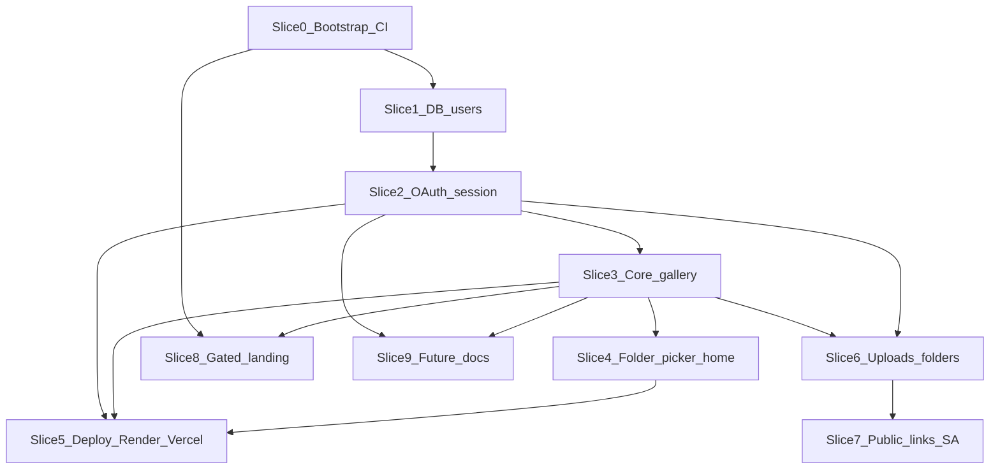

# Drive-backed photo gallery — v1 AI build proposal (sequenced prompt guide)

This document turns the Cursor plan **Drive-backed photo gallery** into a **step-by-step execution guide** for an AI coding agent (or a human following the same slices). It assumes a **new independent Git repository** (not this bible-support workspace).

**Source plan (canonical decisions):** [drive-backed_photo_gallery_c09cf8a1.plan.md](/home/dev/.cursor/plans/drive-backed_photo_gallery_c09cf8a1.plan.md) — read it once per milestone for locked product rules, anonymous link model (Option B + **Anyone with the link**), and deployment shape (Neon + Render + Vercel, patterned after `workout-tracker`).

---

## How to use this guide with an AI

1. **Open the new repo** in the editor and paste **one slice** at a time (the “Agent prompt” block) into a new agent thread.
2. **Attach or reference** this file and the plan file so the agent does not reinterpret product rules.
3. **Do not skip** “Commit checkpoint” or “Tests before merge” — they are part of the definition of done.
4. After each slice: **run the full test/lint suite** for the monorepo root; fix failures **before** starting the next slice.
5. If the agent drifts (extra refactors, wrong phase order): instruct it to **stop and only complete the current slice**.

**Global instructions to prepend to every agent prompt (optional but recommended):**

```text
Constraints:
- Implement ONLY the described slice. Do not start later phases.
- Match existing code style in the repo once it exists; first slice establishes patterns.
- Small, reviewable diffs; no unrelated files.
- After changes: run lint, typecheck, and tests; all must pass before you finish.
- Commit with the provided commit message convention when the slice is complete.
```

---

## Product summary (non-negotiables)

| Topic | Decision |
|-------|----------|
| Stack | `apps/web`: Vite + React + TypeScript + Tailwind. `apps/api`: Node (Express or Hono) + TypeScript. |
| Data | Postgres on **Neon**; Drizzle (recommended) + SQL migrations. |
| Deploy | **Neon** DB, **Render** API, **Vercel** SPA — mirror `workout-tracker` split-host patterns (`CORS_ORIGIN`, `VITE_API_BASE_URL`, cookie `SameSite=None` + `Secure` in prod, `render.yaml`, SPA `vercel.json` rewrites). |
| v1 order | **Core gallery** → **folder picker + home folder** → **deploy wiring** → **uploads + new folders** → **no-sign-in public links** → **gated landing**. |
| Public links | **Option B (locked):** GCP **service account** on API; **only** folders with Drive **Anyone with the link**; permission probe before enable; **not** owner-delegated token for anonymous viewers. |
| UX | Non-programmers: no requirement to paste raw Drive IDs; folder search/picker; wizard for public gallery. |
| v2 docs only | `docs/future/shared-drives.md`, `docs/future/heic-raw-previews.md` during v1. |

---

## Repository layout (target)

```text
package.json                 # pnpm workspaces
pnpm-workspace.yaml
apps/web/                    # Vite + React + Tailwind
apps/api/                    # HTTP API
database/migrations/         # or packages/db — SQL migrations
docs/deployment/
docs/future/
render.yaml
apps/web/vercel.json
```

Adjust names only if the first slice locks a different structure; stay consistent thereafter.

---

## Commit and testing discipline (all slices)

### Commits

- **Commit after every slice** (or more often: logical sub-steps within a slice, e.g. “migrations only” then “OAuth routes only”).
- Use **Conventional Commits**: `feat(api):`, `feat(web):`, `fix(api):`, `chore(ci):`, `docs:`, `test(api):`.
- **One concern per commit** where possible; avoid mixing unrelated API + UI unless the slice is explicitly combined.
- **Never** commit secrets: `.env`, service account JSON, OAuth client secret — only `.env.example` with placeholders.

### Testing (minimum bar)

| Layer | When | What |
|-------|------|------|
| API | Every slice touching `apps/api` | `pnpm -C apps/api test` (Vitest); add tests for new routes and authz edge cases. |
| Web | Every slice touching `apps/web` | `pnpm -C apps/web test` (Vitest + Testing Library); MSW for `fetch` to your API. |
| Root | End of each slice | `pnpm lint` + `pnpm test` (or root scripts that fan out to both packages). |
| Manual | After OAuth / cookies / CORS | Browser: sign-in flow, session persists, `/api/*` from Vercel origin to Render with `credentials: 'include'` without CORS errors. |

### CI (bootstrap slice)

- GitHub Actions (or equivalent): on PR — **install**, **lint**, **typecheck**, **test**, **build** for both apps.
- Fail PRs if any step fails.

---

## Slice timeline (indicative effort)

Rough calendar time for **one experienced implementer** or a strong agent; **double** for GCP/OAuth/Drive edge cases or first-time Neon/Render/Vercel setup.

| Slice | Focus | Rough effort |
|-------|--------|----------------|
| 0 | Monorepo + CI + health | 0.5–1.5 days |
| 1 | DB + migrations + Neon docs | 0.5–1 day |
| 2 | Google OAuth + cookies + CORS | 1–3 days |
| 3 | Core Drive + gallery UI + authz | 2–4 days |
| 4 | Folder picker + home folder | 1–2 days |
| 5 | Render + Vercel + deploy docs | 0.5–1.5 days |
| 6 | Uploads + folders + write scopes | 2–4 days |
| 7 | Public links + SA + wizard | 2–5 days |
| 8 | Gated landing | 0.5–1 day |
| 9 | Future docs only | 0.25–0.5 day |

**Ballpark total:** ~2–4 calendar weeks solo, excluding Google OAuth **app verification** if Google requires it for your scopes.

---

## Slice dependencies



**Parallelism:** **Slice 9** can start any time after **Slice 2–3** (docs only). **Slice 5** can overlap **Slice 4** lightly but should complete once **Slice 3** is stable. **Slice 8** can start after **Slice 0** + minimal web shell; finalize gating once **Slice 3** navigation exists.

---

## Git workflow (branches and tags)

- **`main`:** always deployable; branch protection; required CI on PR.
- **Per slice:** `feat/slice-03-core-gallery`, `feat/slice-07-public-links`, etc. (match slice numbers in this doc).
- **Fixes during a slice:** `fix/slice-03-media-authz` branched from the active slice branch; merge back before merging slice to `main`.
- **Merge policy:** Prefer **one slice per PR**; squash merge to `main` is fine if your team likes a linear history.
- **Optional tags:** `milestone/slice-05-deploy` after first successful **staging** deploy using real Neon + Render + Vercel (or production if you skip staging).

---

## Definition of Ready (DoR) — before starting each slice

| Slice | Prerequisites |
|-------|----------------|
| 0 | None (greenfield). |
| 1 | Local or CI Postgres; Neon account optional until Slice 5. |
| 2 | GCP project; OAuth **Web** client; redirect URIs for local (and Render URL placeholder); `GOOGLE_CLIENT_ID` / secret available **locally** via env, never committed. |
| 3 | Slice 2 complete; Drive API enabled on GCP; test Google account with a folder of sample images. |
| 4 | Slice 3 complete. |
| 5 | Neon `DATABASE_URL`; Render + Vercel accounts; production-like origins chosen. |
| 6 | Slice 2–3 stable; decision on **incremental scope** vs **re-consent** for write scopes documented. |
| 7 | Slice 6 complete (or at least read path stable); GCP **service account** created; SA JSON mount path on Render designed; spike note for “Anyone with the link” + SA ACL completed or time-boxed. |
| 8 | Slice 0 + basic web routing. |
| 9 | None beyond Slice 2–3 for technical accuracy of doc references. |

---

## Environment matrix (fill per deployment)

| Variable / concern | Local dev | CI | Staging | Production |
|--------------------|-----------|-----|---------|------------|
| `DATABASE_URL` | Docker Postgres or Neon branch | CI Postgres service | Neon branch | Neon prod |
| `CORS_ORIGIN` | `http://localhost:5173` (or actual dev port) | Omit or localhost | Staging Vercel URL | Prod Vercel URL(s) |
| `VITE_API_BASE_URL` | Empty (Vite proxy) or `http://localhost:8080` | As needed for tests | `https://…onrender.com` | Render API URL |
| `PUBLIC_WEB_ORIGIN` / equivalent | Local SPA origin | — | Staging Vercel | Prod Vercel |
| Session cookie `Secure` / `SameSite` | `Secure` off or dev-only flags | Test doubles | Match prod split-host | `Secure`; `SameSite=None` if cross-site |
| `PUBLIC_LANDING_ENABLED` | `false` until ready | `false` | optional | `false` until launch |

Keep this table in **`docs/deployment/README.md`** with real URLs filled at deploy time.

---

## Secrets inventory (names only — never commit values)

| Secret | Used by | Where stored |
|--------|---------|----------------|
| `DATABASE_URL` | API | Render env, local `.env` |
| `SESSION_SECRET` | API | Render env, local `.env` |
| Token / refresh **encryption key** | API | Render env, local `.env` |
| `GOOGLE_CLIENT_SECRET` | API | Render env, local `.env` |
| `GOOGLE_SERVICE_ACCOUNT_JSON` (or file path) | API | Render **secret file** or env (JSON) |
| OAuth SA private key material | GCP | Only inside SA JSON above |
| Vercel | No API secrets for static SPA if using public `VITE_*` only | — |

Document **rotation**: rotating `SESSION_SECRET` or encryption key typically **invalidates all sessions** — acceptable if called out in runbook.

---

## Rollback and kill switches

- **Deploy rollback:** Render and Vercel support redeploying a previous known-good Git revision; document “last good SHA” in release notes.
- **Migrations:** Failed `preDeploy` migrate should **block** traffic (Render behavior); runbook: fix migration forward only, or restore Neon branch from snapshot if available.
- **Feature-style kills (implement if useful):**
  - `PUBLIC_LINKS_ENABLED=false` — disable creation and public routes while keeping signed-in app.
  - `UPLOADS_ENABLED=false` — hide upload UI and reject write endpoints (optional; can be env-checked in handlers).
- **Emergency:** Revoke OAuth client or rotate secrets if leaked; expect all users to re-sign-in.

---

## Security checklist (v1 minimum)

- [ ] **Media authz:** every `fileId` for stream/meta is under the allowed folder (signed-in and public token paths).
- [ ] **Public link tokens:** store **only a hash** of the opaque token (e.g. SHA-256 of random bytes); compare with constant-time equals.
- [ ] **Rate limits:** stricter on `/api/public/*` than on authenticated read routes.
- [ ] **CORS:** exact origin allowlist; no `*` with credentials.
- [ ] **CSRF:** document strategy for cookie-backed POST/PUT (double-submit cookie, or SameSite + mutation-only from trusted flows).
- [ ] **Helmet** (or equivalent) on API; security headers on static host where possible.
- [ ] **Input validation:** Zod on all query/body/params for new routes.
- [ ] **Logging:** never log refresh tokens, access tokens, or raw public link secrets.

---

## Accessibility expectations (per slice)

Apply from **Slice 3** onward; add to CI/lint if you adopt **eslint-plugin-jsx-a11y** or **markuplint** in the new repo.

- Interactive controls are **keyboard** reachable; visible **focus** styles (Tailwind `focus-visible:`).
- Gallery modal / lightbox: **Escape** closes; **focus trap** or documented focus return; `aria-modal` / labels where appropriate.
- Upload errors: **`aria-live`** polite region or equivalent so screen reader users hear failures.
- Public viewer (Slice 7): same baseline as signed-in gallery (do not regress a11y for anonymous route).

---

## Stop-the-line criteria

Do **not** start the next slice until resolved:

- Any **authz bug** in list or media routes (cross-folder or cross-user leak).
- **OAuth redirect mismatch** or systematic **401** after “successful” login on split hosts.
- **CI red** on `main` or on the open slice PR.
- **Migration drift** between local and CI (journal out of sync).

---

## Slice 0 — Monorepo bootstrap

**Goal:** Empty runnable monorepo: web shows a shell page, API serves `/api/health`, root scripts work.

**Agent prompt:**

```text
Create a new pnpm monorepo with apps/web (Vite + React + TypeScript + Tailwind v4) and apps/api (Node + TypeScript, Express or Hono). Root scripts: dev runs web + api concurrently; lint, test, build, typecheck for both. Add GET /api/health returning { ok: true }. Add apps/web/.env.example with VITE_API_BASE_URL= and apps/api/.env.example with placeholders for DATABASE_URL, SESSION_SECRET, CORS_ORIGIN, GOOGLE_* (do not add real secrets). Add GitHub Actions CI: install, lint, typecheck, test, build. Add README with local dev instructions. Do not implement OAuth or Drive yet.
```

**Definition of done**

- [ ] `pnpm install` at root succeeds.
- [ ] `pnpm dev` runs web and API; web can call health via proxy or `VITE_API_BASE_URL`.
- [ ] CI green on a clean checkout.

**Commit checkpoint:** `chore: bootstrap pnpm monorepo with web, api, and ci`

---

## Slice 1 — Postgres schema and session user storage

**Goal:** Neon-compatible Postgres schema: `users` with `google_sub` (unique), encrypted refresh token fields, `default_folder_id` nullable; migration runs locally and in CI (use test DB or docker-compose postgres for CI if needed).

**Agent prompt:**

```text
Add Drizzle (or locked ORM) + Postgres migrations for table users: id, google_sub unique, encrypted_refresh_token, refresh_token_version or similar, default_folder_id nullable, created_at, updated_at. Add a minimal db client module in apps/api with connection from DATABASE_URL (sslmode=require). Add integration test or migration smoke in CI. No OAuth yet; optional seed script off by default. Document Neon setup in docs/deployment/neon.md (short).
```

**Definition of done**

- [ ] Migrations apply cleanly on empty DB.
- [ ] API boots with valid `DATABASE_URL` and fails fast with clear error if missing.

**Commit checkpoint:** `feat(api): add users table and database client`

**Tests:** API test that migration ran (or schema assertion); CI runs migrations against test Postgres.

---

## Slice 2 — Google OAuth (user) + session cookie (split-host ready)

**Goal:** Sign in with Google → code exchange on **API** → store encrypted refresh → **httpOnly** session cookie; redirect to **frontend origin** env. Prepare for Vercel + Render: `SameSite=None`, `Secure` in production, `CORS_ORIGIN` allowlist.

**Agent prompt:**

```text
Implement Google OAuth 2.0 authorization code flow with PKCE initiated from the SPA or API as you prefer; token endpoint and callback on apps/api only. Persist refresh token encrypted in users row; issue session cookie (name documented). Env: GOOGLE_CLIENT_ID, GOOGLE_CLIENT_SECRET, GOOGLE_OAUTH_REDIRECT_URI (Render URL), PUBLIC_WEB_ORIGIN (Vercel URL), SESSION_SECRET, CORS_ORIGIN. Add GET /api/auth/me returning 401 or user id/google_sub. Add logout clearing session. Add Vitest tests with mocked Google token exchange. Document GCP OAuth client setup in docs/deployment/google-oauth.md.
```

**Definition of done**

- [ ] Local dev: OAuth round-trip works (localhost origins documented).
- [ ] No secrets in client bundle; only client id in web if needed for PKCE start.

**Commit checkpoint:** `feat(api): google oauth session and me endpoint` (+ `feat(web): sign-in entry` if UI added)

**Tests:** Mock Google HTTP; cookie set on response; `/api/auth/me` behavior.

---

## Slice 3 — Core Drive API + gallery UI (signed-in only)

**Goal:** Authenticated `files.list` for images in a folder, pagination, search query passthrough; `files.get` metadata; **authorized** media stream (verify file belongs to folder tree). Web: Tailwind grid, accessible slideshow/modal, route `/photos/folder/:folderId`, `fetch` with `credentials: 'include'`.

**Agent prompt:**

```text
Implement Drive v3 on server only using user's access token from refresh. Routes: GET /api/drive/folders/:folderId/files?pageToken=&q= for images (mimeType image), GET /api/drive/files/:fileId/meta, GET /api/drive/files/:fileId/media streaming with parentage check so file is under folderId. Zod validate params/query. Rate limit read routes. Web: gallery page with grid, keyboard-accessible lightbox, loading and error states. MSW tests for web; supertest or app inject tests for API with mocked Drive fetch.
```

**Definition of done**

- [ ] Cannot stream arbitrary `fileId` without folder scope check.
- [ ] Basic a11y: focus trap or sensible tab order in modal, Escape to close.

**Commit checkpoint:** `feat: signed-in folder gallery and media proxy`

**Tests:** Authz tests for media route (wrong file id, wrong folder); list pagination.

---

## Slice 4 — Folder picker + default home folder (all in-app)

**Goal:** API lists folders user can access (paginated search). Web: picker UI + save `default_folder_id` to Postgres; `/photos` uses saved folder or forces picker until set.

**Agent prompt:**

```text
Add API to search folders (Drive q for mimeType folder + name contains + pagination). Add PATCH /api/me/default-folder or equivalent with Zod body { folderId }. Web: first-run flow and settings page to change home folder; no user-facing requirement to paste Drive IDs. E2E optional; unit/integration tests required.
```

**Definition of done**

- [ ] New user without `default_folder_id` is guided to pick a folder.
- [ ] Changing folder updates DB and UI.

**Commit checkpoint:** `feat: folder picker and persisted home folder`

**Tests:** API validation tests; web test for redirect/guard behavior.

---

## Slice 5 — Deploy wiring (Render + Vercel + Neon)

**Goal:** `render.yaml` Blueprint, `preDeployCommand` migrations, `healthCheckPath: /api/health`, env var documentation aligned with `workout-tracker`. Vercel `vercel.json` SPA rewrites. `docs/deployment/README.md` with copy/paste env blocks.

**Agent prompt:**

```text
Add render.yaml for apps/api (or root build if monorepo build differs): pnpm install, build, preDeploy migrate, start. Document CORS_ORIGIN, DATABASE_URL, all auth envs, PUBLIC_WEB_ORIGIN. Add apps/web/vercel.json rewrites. Add smoke script pattern DEPLOY_URL=... optional. Mirror workout-tracker deployment docs structure without copying proprietary secrets.
```

**Definition of done**

- [ ] A maintainer can deploy following only repo docs.
- [ ] Health check path matches Render config.

**Commit checkpoint:** `docs: render and vercel split deployment`

**Tests:** CI still passes; optional smoke script documented.

---

## Slice 6 — Uploads + new folders (after core)

**Goal:** Create folder and upload images via API (multipart or resumable for large files); web UI with progress. OAuth scopes include write; document verification implications.

**Agent prompt:**

```text
Extend Google OAuth scopes for write access (minimal scopes). Implement POST /api/drive/folders with parentId + name; POST /api/drive/upload multipart to parent folder. Enforce user owns/can write parent. Web: create folder dialog, drag-drop upload, progress and errors. Add rate limits for writes. Tests with mocked Drive. Document OAuth consent verification in docs/deployment/google-oauth.md.
```

**Definition of done**

- [ ] Uploads cannot target folders the user cannot write.
- [ ] Clear errors for quota / consent failures.

**Commit checkpoint:** `feat: drive folder create and image upload`

**Tests:** Write authz; multipart boundary tests if applicable.

---

## Slice 7 — No-sign-in public galleries (Option B)

**Goal:** Service account JSON on Render; `public_links` table (hashed token, `folder_id`, `created_by`, `revoked_at`, `expires_at`); owner-only API to create/revoke link after **Anyone with the link** probe; public GET list/media by token with strict rate limits and parentage checks. Wizard UX + `docs/deployment/google-service-account.md` for operators and end users (including SA email share if required after spike).

**Agent prompt:**

```text
Implement GCP service account client for Drive read-only operations. Add migration public_links. Add signed-in endpoints POST/DELETE public link for folderId with permission probe using user's OAuth token (reject unless Drive link allows anyone-with-link per your probe implementation). Add unauthenticated routes GET /api/public/:token/files and .../media with hashed token lookup, revoked/expiry checks, per-IP and per-token rate limits, and file parent under folder. Web: enable/revoke/copy link wizard with non-programmer copy. Document SA setup and user steps in docs/deployment/google-service-account.md. Vitest for all authz branches.
```

**Definition of done**

- [ ] Public routes never leak other folders’ files.
- [ ] Revoked links return 404 immediately.

**Commit checkpoint:** `feat: public gallery links with service account`

**Tests:** Token hash verification; revoked; wrong file id; rate limit behavior (unit or integration with limiter mocked).

---

## Slice 8 — Gated landing page

**Goal:** Marketing/landing route and copy exist; default **`PUBLIC_LANDING_ENABLED=false`** hides it from default nav or returns 404 for marketing path until enabled.

**Agent prompt:**

```text
Add landing route with accessible static marketing content explaining the app and privacy high-level. Gate with env PUBLIC_LANDING_ENABLED (Vite) or server flag—default off. When off, root may redirect to /photos or show minimal shell. Add content guidelines (no legal claims beyond scope). Tests for gating behavior.
```

**Commit checkpoint:** `feat(web): gated marketing landing`

---

## Slice 9 — Forward-looking v2 docs (parallel, can run anytime after Slice 3)

**Agent prompt:**

```text
Add docs/future/shared-drives.md and docs/future/heic-raw-previews.md per plan: API parameters, UX implications, migration checklist for v2. No production code for these features.
```

**Commit checkpoint:** `docs: future shared drives and heic/raw notes`

---

## Optional follow-up slices (post–v1 hardening)

| Slice | Topic | Notes |
|-------|--------|--------|
| H1 | **Structured logging** | Pino + request id; correlate with user `google_sub` where safe. |
| H2 | **Error reporting** | Sentry (or similar) web + API; scrub tokens in beforeSend. |
| H3 | **CSP** | Vercel headers or middleware; tune for Vite asset hashes. |
| H4 | **Load / cost** | Note on Render egress + Drive quotas for media proxy; optional caching rules doc only. |
| H5 | **Legal / trust** | Terms + privacy pages when you want them live (separate from gated marketing). |

---

## Open technical spike (schedule inside Slice 7)

Confirm whether **Anyone with the link** alone allows the **service account** to `files.list` without an explicit share to the SA email for **consumer Gmail** vs **Workspace**. Document the outcome in `docs/deployment/google-service-account.md` and lock the wizard steps accordingly.

---

## Checklist: “v1 ready for real users”

- [ ] All slices above done; CI green.
- [ ] Production deploy on Neon + Render + Vercel; smoke pass.
- [ ] OAuth consent screen appropriate for scopes; internal testing account verified.
- [ ] Public link wizard tested with a real “Anyone with the link” folder.
- [ ] Landing still gated until you deliberately enable it.

---

## Appendix — Suggested pull request template

Save as `.github/pull_request_template.md` in the gallery repo (adapt names).

```markdown
## Slice

- [ ] Slice number and title (e.g. **Slice 3 — Core gallery**):

## Summary

- What changed (1–3 sentences):

## How to test

- [ ] `pnpm lint`
- [ ] `pnpm test` (root or per-package as documented)
- [ ] Manual: …

## Checklist

- [ ] No secrets or `.env` files committed
- [ ] Tests added or updated for new behavior / authz
- [ ] Docs updated if env or deploy behavior changed
- [ ] Slice scope only — no unrelated refactors

## Screenshots (if UI)

…
```

---

## Appendix — Minimal “resume prompt” if a thread is lost

```text
Continue the photo-gallery repo per docs/PROPOSAL.md (this file). Last completed slice: [N]. Next slice: [N+1]. Run full lint/test before committing. Do not implement features outside that slice.
```
